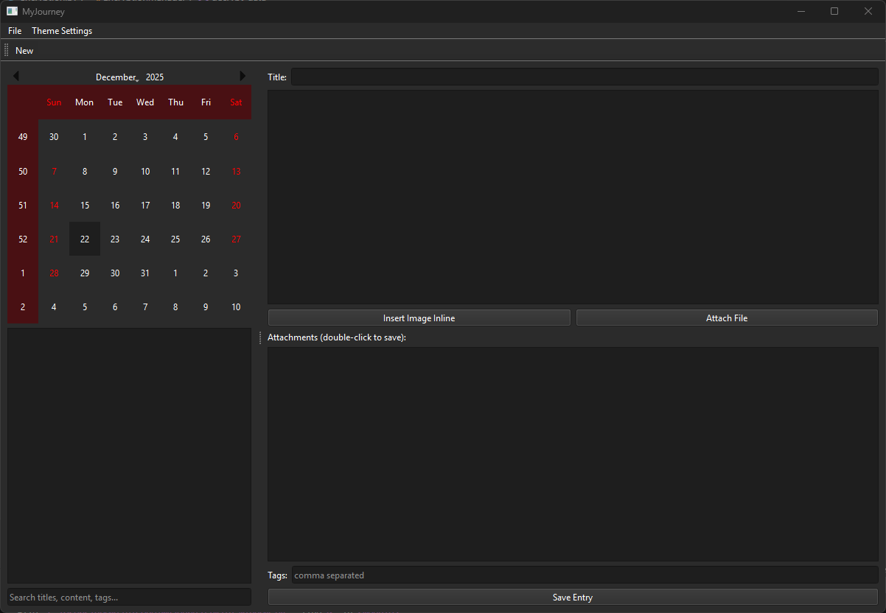

MyJournal
=========

MyJournal is a simple personal journaling app. Use it to write daily entries, attach files or images, and keep your notes private with a master password and two-factor authentication.

Quick start:

- Activate the project's virtual environment:

For Windows, activate the virtual environment and run:

```powershell
& .\.venv\Scripts\Activate.ps1
python main.py
```

For Linux (bash/zsh), activate the virtual environment and run:

```bash
source .venv/bin/activate
python main.py
```

- On first run you'll be asked to create a master password and scan a QR code with an authenticator app.
- After setup, log in with your password and the 6-digit code from the authenticator app.

Notes
----------
The database is encrypted. If you lose your password or the authenticator, your data cannot be retrieved.

Screenshot
----------


