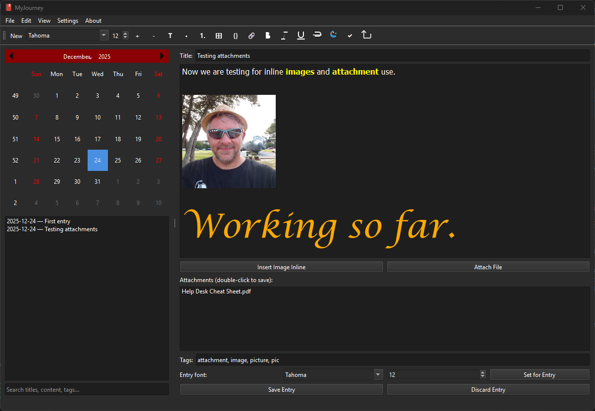

MyJournal
=========

A small, encrypted personal journaling app with a rich-text editor.



Run
---
- Windows (PowerShell):

```powershell
& .\\.venv\\Scripts\\Activate.ps1
.venv\\Scripts\\python.exe main.py
```

- Linux / macOS (bash):

```bash
python3 -m venv .venv
source .venv/bin/activate
python main.py
```

Features
--------
- **Security**: Argon2id password hashing, Fernet (AES-128) field-level encryption, and 2FA (TOTP) support.
- **Rich-Text Editor**: Bold, italic, underline, strike, custom colors, and inline images.
- **Advanced Formatting**: Insert tables, code blocks, and hyperlinks with dedicated UI controls.
- **Export Options**: Export your entries to PDF, Markdown, or HTML formats.
- **Statistics Dashboard**: Visualize your journaling habits with word counts, tag frequency, and activity history.
- **Attachments**: Attach any file to your entries with thumbnail previews for images.
- **Auto-Maintenance**: Automatic inactivity logout, encrypted database backups, and image memory management (auto-resizing).
- **Customization**: Per-entry or app-default font settings and dark/light theme support.
- **Keyboard Shortcuts**: Standard shortcuts for formatting (Ctrl+B/I/U), saving (Ctrl+S), and searching (Ctrl+F).

Notes
-----
- The database is encrypted; losing the master password or authenticator makes data unrecoverable.
- Inactivity timeout and autosave intervals can be configured in the Settings dialog.

## License

This project is licensed under the MIT License - see below for details.

---

MIT License

Copyright © 2025 Quantum Pixelator

Permission is hereby granted, free of charge, to any person obtaining a copy
of this software and associated documentation files (the "Software"), to deal
in the Software without restriction, including without limitation the rights
to use, copy, modify, merge, publish, distribute, sublicense, and/or sell
copies of the Software, and to permit persons to whom the Software is
furnished to do so, subject to the following conditions:

The above copyright notice and this permission notice shall be included in all
copies or substantial portions of the Software.

THE SOFTWARE IS PROVIDED "AS IS", WITHOUT WARRANTY OF ANY KIND, EXPRESS OR
IMPLIED, INCLUDING BUT NOT LIMITED TO THE WARRANTIES OF MERCHANTABILITY,
FITNESS FOR A PARTICULAR PURPOSE AND NONINFRINGEMENT. IN NO EVENT SHALL THE
AUTHORS OR COPYRIGHT HOLDERS BE LIABLE FOR ANY CLAIM, DAMAGES OR OTHER
LIABILITY, WHETHER IN AN ACTION OF CONTRACT, TORT OR OTHERWISE, ARISING FROM,
OUT OF OR IN CONNECTION WITH THE SOFTWARE OR THE USE OR OTHER DEALINGS IN THE
SOFTWARE.
